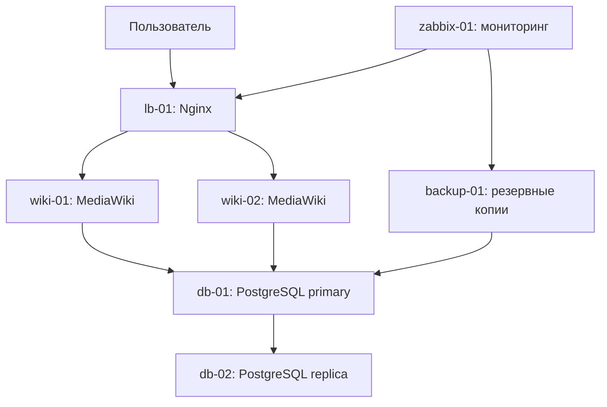

# Отказоустойчивая инфраструктура MediaWiki в Yandex Cloud

Учебный проект автоматизированного развёртывания MediaWiki с помощью Terraform и Ansible.

В проекте реализованы:

- семь виртуальных машин в Yandex Cloud;
- два сервера MediaWiki;
- балансировщик Nginx;
- PostgreSQL primary и replica;
- резервное копирование и тестовое восстановление;
- мониторинг MediaWiki и резервных копий в Zabbix;
- проверка отказоустойчивости веб-уровня;
- автоматический запуск и остановка инфраструктуры.

## Архитектура



## Серверы

| Сервер | Внутренний IP | Назначение |
|---|---:|---|
| `lb-01` | `10.50.0.10` | Балансировщик Nginx |
| `wiki-01` | `10.50.0.21` | Первый сервер MediaWiki |
| `wiki-02` | `10.50.0.22` | Второй сервер MediaWiki |
| `db-01` | `10.50.0.31` | PostgreSQL primary |
| `db-02` | `10.50.0.32` | PostgreSQL replica и тест восстановления |
| `backup-01` | `10.50.0.41` | Хранение резервных копий |
| `zabbix-01` | `10.50.0.51` | Zabbix Server |

## Технологии

Terraform, Ansible, Ansible Vault, Yandex Cloud, Ubuntu, Nginx,
MediaWiki, PostgreSQL, Zabbix, Bash и Git.

## Структура проекта

```text
Terraform/                  инфраструктура Yandex Cloud
Ansible/                    настройка и проверка серверов
Ansible/roles/              роли настройки компонентов
Ansible/tools/              автоматизация и проверка Zabbix
docs/mediawiki_arch.drawio  исходная схема инфраструктуры
start-project.sh            полный запуск проекта
start-project-vms.sh        запуск виртуальных машин
schedule-auto-stop.sh       таймер автоматической остановки
stop-project.sh             безопасная остановка проекта
```

## Запуск и остановка

Все команды выполняются из корня проекта.

Полный запуск:

```bash
./start-project.sh
```

Скрипт запускает виртуальные машины, получает новый публичный IP
балансировщика, обновляет Ansible inventory и URL MediaWiki,
выполняет проверки и устанавливает автоотключение через 40 минут.

Ручная остановка:

```bash
./stop-project.sh
```

После остановки перестают тарифицироваться vCPU и RAM.
Диски продолжают тарифицироваться.

Другой интервал автоотключения, например 20 минут:

```bash
AUTO_STOP_SECONDS=1200 ./schedule-auto-stop.sh
```

## Проверка отказоустойчивости MediaWiki

```bash
cd Ansible
ansible-playbook \
  -i inventory.ini \
  --ask-vault-pass \
  verify_web_failover.yml
```

## Проверка восстановления резервной копии

```bash
cd Ansible
ansible-playbook \
  -i inventory.ini \
  --ask-vault-pass \
  verify_backup_restore.yml
```

## Проверка мониторинга резервных копий

```bash
cd Ansible
ansible-playbook \
  -i inventory.ini \
  --ask-vault-pass \
  tools/verify-zabbix-backup.yml
```

Zabbix контролирует показатель `mediawiki.backup.age`.
Если резервная копия старше 26 часов, срабатывает триггер.

## Безопасность

- пароли хранятся в зашифрованном Ansible Vault;
- пароль Vault и закрытые SSH-ключи не входят в репозиторий;
- состояния Terraform, планы, журналы и временные копии исключены;
- публичные IP назначаются динамически и обновляются при запуске;
- перед публичной публикацией реальный `vault.yml` следует заменить
  файлом-примером либо использовать приватный репозиторий.

## Ограничения

Проект предназначен для обучения и демонстрации:

- прерываемые ВМ могут быть остановлены облачной платформой;
- автоматическое переключение PostgreSQL на реплику не реализовано;
- резервные копии находятся в том же облаке;
- постоянный публичный IP, доменное имя и TLS не настроены;
- для промышленной эксплуатации требуется внешнее хранилище копий.

## Подтверждённые проверки

Успешно проверены:

- доступность всех узлов через Ansible;
- работа MediaWiki через балансировщик;
- переключение между `wiki-01` и `wiki-02`;
- репликация PostgreSQL;
- создание и восстановление резервной копии;
- мониторинг возраста копии в Zabbix;
- автоматическое обновление публичного IP;
- запуск, автоотключение и ручная остановка инфраструктуры.
